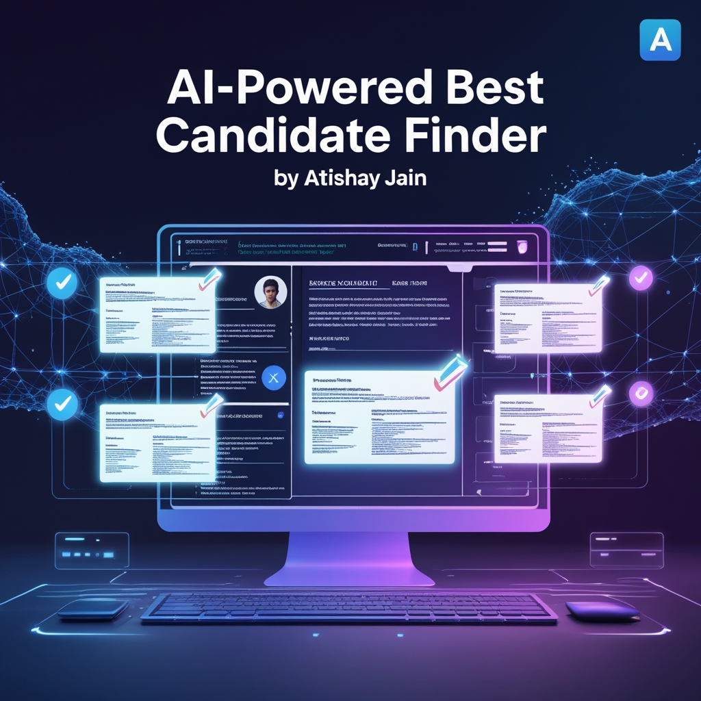

# Job-Fit CV Finder

◦ Developed an AI-powered resume ranking system to identify the top 5 most relevant resumes based on a given job description.
 
◦ Implemented resume parsing and preprocessing techniques including data cleaning, keyword extraction, and normalization to ensure accurate comparisons.
 
◦ Utilized vectorization and similarity metrics to match resumes with job requirements; integrated LLM API to enhance contextual understanding.
 
◦ Conducted data analysis to refine matching logic and improve result relevance.
 
◦ Achieved high precision in candidate recommendations, streamlining the recruitment process through intelligent automation.
 
